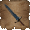

# Feat of Necromancy

A mod for [Hands of Necromancy](https://forum.zdoom.org/viewtopic.php?f=19&t=74989) that adds RPG style leveling.

## Leveling

Gain levels through XP by killing monsters. Your stats show on your automap, and an XP bar tracks your progress at the bottom of your status bar.

## Stats

When you gain a level you'll get a health boost and have 5 stat points to distribute.

### Vengeance

Your lust for revenge against the undead kings. This grants you higher maximum health and damage to your melee weapons, as well as increase your carrying capacity for heavy weapons.

### Ferocity

Your primal power that fuels transformations. This increases your morph ammo and grants abilities when raised to certain milestones.

### Scorn

Your bitterness and anger towards those who have crossed you. This increases your maximum ammo for magical weapons. You will learn new spell attacks when raised to certain milestones.

## Weapon Enhancements

### Melee

There are new melee weapons. An axe that can be found on the levels and the scythe can now be used to slash your foes. Incresae your Vengeance for even greater damage.

### Magical

You can earn new abilities for every mage weapon by increasing Scorn. Some provide alternative fire modes, while others can be charged up for greater attacks.

### Transformation

Your transformations become more powerful as you increase Ferocity, gaining new attacks, improving some existing attacks, and providing ways to replenish your energy.

### Heavy Weapons

The grenades can now be timed by holding in the fire button. This allows more precision when preparing a throw, or the ability to time a grenade to explode in an area to get hard to target monsters.

## More Monsters

In order to help fill the world and scale up the challenge, monsters have been beefed up and repopulate.

### Monster Repopulations

More monsters spawn in as you explore each hub at a variable time. You'll find challenging fights in places you did not expect, allowing the strength of the level design to facilitate new fights.

### Monster Buffs

Monsters have an increaseing chance to appear with abilities as you level. They can spawn with the following buffs.

 * Fire - Spews meteors of fire below them.
 * Lightning - Teleport with a crash of lightning when hurt.
 * Stone = Crushing blows and stone skin make them harder to kill.
 * Ice - Sheds orbs of cold energy when damaged.
 * Blood - Steal your health when they damage you.
 * Shaman - Raise defeated enemies as ghosts.
 * Brute - Bigger and takes more damage.
 * Spectre - Hard to see and more fierce.

 ### Monster Drops

 Any monster can now drop health or ammo. Buffed monsters can drop better ammunition based on their type.
